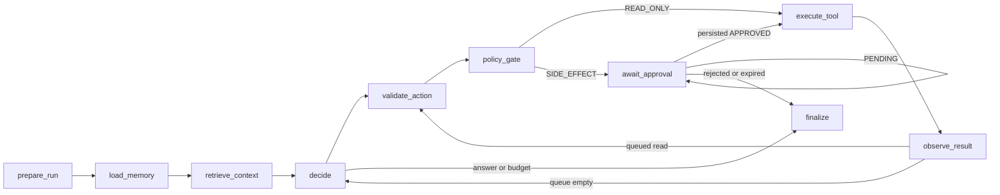

# Durable Agent Runtime

One production `StateGraph` composes typed providers, hybrid retrieval, the
OpsDesk model catalog and the trusted execution gateway. Every tool execution
passes policy and every side effect requires exact approval. `load_memory`
checkpoints only scoped IDs; the provider request resolves current rows transiently.
See [Governed Memory](GOVERNED_MEMORY.md) and
[Observability and Audit](OBSERVABILITY_AND_AUDIT.md) for those boundaries.



Protocol/policy failures also route to FAILED finalization. Every terminal result
persists explicit status and counters in `runs`; text alone never means success.
Multiple structured READ_ONLY calls are validated as a bounded queue and execute
serially through the same action/policy path. A batch containing any SIDE_EFFECT
is rejected with zero dispatch and a bounded correction. Textual pseudo-tool
requests can trigger a new model decision but never become executable actions.
Observations and evidence are primitive untrusted data and cannot change the
trusted registry. A pending post-restart verification obligation blocks final
completion until the model emits a genuine structured `get_service_status` for
the same service and observes the required status. The runtime does not synthesize
that read. Queue, repair count and obligation survive checkpoint recovery.

## Checkpoint setup and strict state

Pinned `langgraph==1.2.12`, `langgraph-checkpoint-postgres==3.1.2` and
`langgraph-checkpoint==4.2.0` remain unchanged. All acceptance invocations use
`AsyncPostgresSaver`, `thread_id=run_id`, and `durability="sync"`. Explicit serde is
`JsonPlusSerializer(allowed_msgpack_modules=None, pickle_fallback=False)`.
Custom application classes are not revived; runtime snapshots contain primitive
JSON-safe data. Providers, embeddings, Engine, tools, Gateway and fault callbacks
live only in `Runtime[Context]`, reconstructed after restart.

Run once after project Alembic migrations:

```text
uv run python scripts/setup_checkpoints.py
```

Bootstrap and database verification call this explicit command. Saver construction
and normal runtime startup never call setup. Tests explicitly setup only their
owned disposable schemas. The four framework tables checkpoint_migrations,
checkpoints, checkpoint_blobs and checkpoint_writes are not project Alembic tables;
no project migration or dependency change is added. On Windows the portable
`run_async` entry point uses SelectorEventLoop for psycopg async compatibility.
An embedding provider is passed through context, and retrieval always calls the
hybrid retrieval service; DB integration uses deterministic 1024-dimensional fixtures.

## Runtime surface and approval

`open_runtime(context, url)` opens a fresh strict saver and graph. `start(run,
RunConfig(...))` creates the run once before invocation; repeated start fails.
`inspect(run_id)`, `resume(run_id, json_value)` and `continue_run(run_id)` expose
checkpoint inspection, interrupted resume with Command, and ordinary failure
continuation with None. Unknown/wrong threads cannot resume. Resume values must be
JSON-safe and never decide approval. Recoverable infrastructure exceptions retain
the previous checkpoint for continuation; provider protocol/policy violations
produce bounded FAILED reasons. Terminal continuations preserve terminal state.

`validate_action` checkpoints runtime key/action identity before policy.
`policy_gate` uses deterministic approval `ensure`: SHA-256 of compact JSON
["approval", action_id], with advisory serialization and exact-payload checks.
Re-entry/concurrent ensure returns one existing row, preserving lifecycle and
human timestamps; conflict fails. Explicit `create` creates a new
approval behavior. `await_approval` performs interrupt as its first consequential
operation. The local approval endpoint persists a decision through Approvals outside the graph, then resumes the same
thread. The graph reloads the row: PENDING re-interrupts; REJECTED/EXPIRED terminate
without effects; APPROVED reaches the exact gateway checks.

## Counters and recovery

Model budget defaults to 8, accepts strict integers 1..12 and rejects 13 before
execution. It is checked before each model decision; the high recursion_limit is
an independent framework backstop (default 256). No-progress fixtures stop at
exactly 8 or 12 successful model decisions. Tool-loop fixtures also obey the
semantic model budget. Counters are checkpointed after successful node output and
persisted to project runs at status boundaries/finalization. A recoverable failed
model node can re-enter; model_steps counts durable decisions, not every network
attempt made during externally retried failures.

Tool steps count successful logical gateway node outputs, including receipt
reconciliation after a lost output. The counter increment is returned only after
the optional test-only post-Gateway/pre-node-return fault hook. Therefore killing
that node and replaying its exact receipt yields one logical tool step. No automatic
side-effect retry exists outside trusted execution receipt reconciliation.

## Real fresh-process proof

On a clean exact-head checkout with a fresh disposable migrated DB:

```text
uv run python -m scripts.probe_runtime --output ABSOLUTE_EXTERNAL_EVIDENCE.json
```

The proof explicitly sets up checkpoints, seeds fictional state/unrelated
sentinels and real retrieval evidence, starts the graph until approval interrupt, and
persists APPROVED outside the graph. Worker A resumes with real OpsDesk stdio;
after Gateway has committed one effect/receipt and consumed approval, the fault
hook atomically signals the parent and blocks before execute_tool returns.
The parent independently checks the database and retained execute_tool checkpoint,
then performs actual OS termination and waits for death. Fresh worker B rebuilds
all dependencies and invokes None on the same Postgres thread. It reconciles the
existing receipt, observes replayed=true and completes with two model decisions,
one tool step, one notification and one receipt. Checkpoint history contains the
old thread and additional checkpoints; unrelated state is unchanged.

The harness uses portable subprocess.Popen and worker-thread bounded waits.
Windows venv launchers may have a separate PID: a worker/parent handshake binds the
actual Python worker to its owned launcher before OS termination. Evidence retains
both launcher/worker PIDs, exit codes, kill phase, checkpoint IDs, exact run/thread,
server/protocol and before/after counts. A separate disposable-schema calibration
actually sends a second distinct key on the controlled raw testing surface and
proves the duplicate-effect oracle rejects two physical effects. Production code
is never weakened for this calibration. Ubuntu database CI runs the actual kill
proof via its unchanged integration/combined pytest commands; no Docker/process
proof is required in static jobs. No model downloads or live-model thresholds are
added.

Primary framework sources:
[Postgres saver/setup](https://github.com/langchain-ai/langgraph/blob/main/libs/checkpoint-postgres/README.md),
[strict serializer](https://github.com/langchain-ai/langgraph/blob/main/libs/checkpoint/README.md),
[interrupt](https://reference.langchain.com/python/langgraph/types/interrupt).
Exact installed-source and live preflight evidence is authoritative for pinned API
behavior; no dependency upgrade was used.


Schema regression comparison reflects the test-owned schema explicitly: PostgreSQL
search-path visibility can also expose public framework tables. Exact project
names/types/constraints and migration round trips remain mandatory. A real extra
table inside the owned schema is deliberately added and must produce a schema
difference; only tables outside that ownership boundary are excluded. No unknown
owned table is allowlisted away and no framework table enters Alembic metadata.
